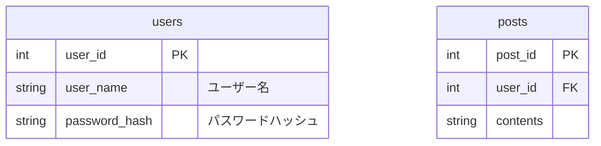
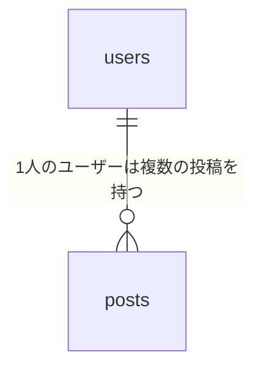

# テーブル定義


# ER図



# memo

```
docker compose run --rm --entrypoint "poetry run pytest" api
docker compose run --rm --entrypoint "poetry run black ." api
docker compose run --rm --entrypoint "poetry run isort ." api
docker compose run --rm --entrypoint "poetry run pylint api" api
```
