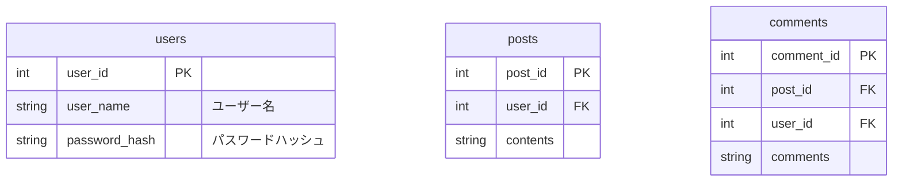
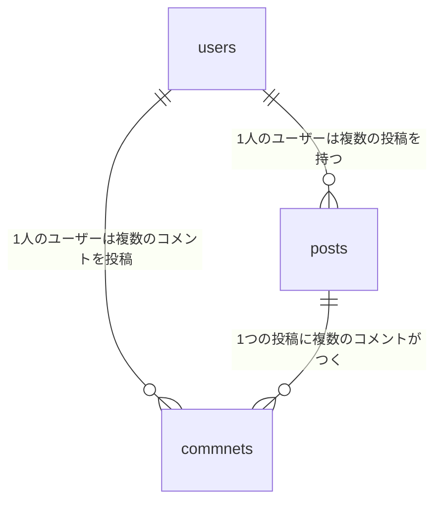

# テーブル定義


# ER図



# Flow
## sign up
```mermaid
sequenceDiagram
    autonumber
    actor ユーザー
    participant /users
    ユーザー->>/users: postリクエスト
	Note left of /users: user_name, password
    /users->>ユーザー: Status Code 200
```

## login
```mermaid
sequenceDiagram
    autonumber
    actor ユーザー
    participant /token
    ユーザー->>/token: postリクエスト
	Note left of /token: user_name, password
    /token->>ユーザー: Status Code 200
	Note left of /token: access_token, token_type
```

# memo

```
docker compose run --rm --entrypoint "poetry run pytest" api
docker compose run --rm --entrypoint "poetry run black ." api
docker compose run --rm --entrypoint "poetry run isort ." api
docker compose run --rm --entrypoint "poetry run pylint api" api
```
